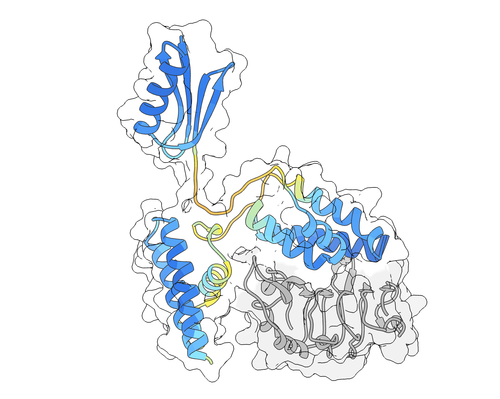
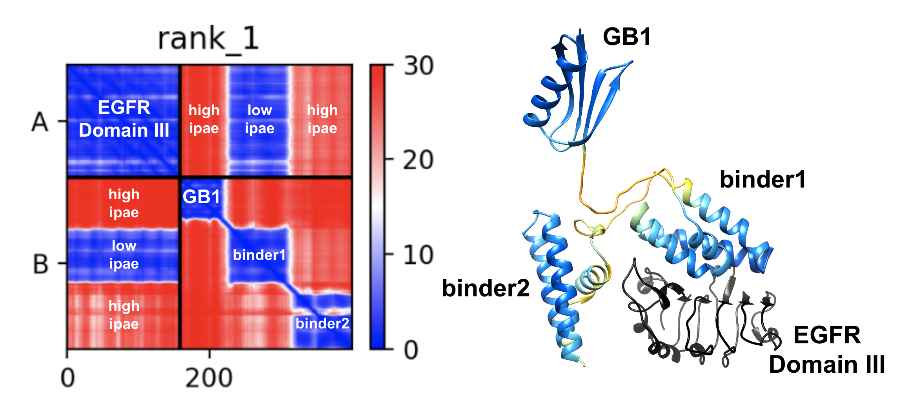

# EGFR Binders: Round 2 of Adaptyv Bio's Protein Design Competition

Cianna Calia - Paesani Lab, UC San Diego

  

### Methods write-up:

Each of the sequences I am submitting for Round 2 is a "composite binder" consisting of three components: the solubility tag GB1 (1) at the N-terminus to enhance expression, a pair of distinct minibinder domains generated with BindCraft (2), and two diffused disordered linkers connecting the structured domains. Unlike my Round 1 designs, my Round 2 designs have significant flexibility and contain disordered regions diffused using a novel method. This demonstrates a case where a strategy that increases the odds of success (I hope!) also gives worse inter-chain pae_interaction values.

I generated several batches of small binders for EGFR's Domain III using the new tool BindCraft, with default filters and default advanced settings. I provided residues 312-470 of chain A of PDB 6ARU (3) as the target, with these hotspots: A348,A350,A382,A412,A417,A438. Only designs with ipTM >= 0.8 were considered for further analysis, and those containing only two helices were discarded. For the 51 minibinders meeting those criteria, I ran NetSolP (4) to predict solubility and usability.

My submitted sequences each contain two potential binding domains such that binding of either will compete with EGF's interaction with the receptor. I propose that one potential strategy to increase the likelihood of finding a high-affinity binder with a minimal number of experiments is to test designed binders in pairs by connecting two distinct binders in a single chain to be expressed. This method can be cost-effective when it is cheaper to experimentally evaluate a small number of longer sequences rather than a larger number of short sequences.

I paired up my minibinders such that each pair contains one design that was top-ranked by ipTM and pae_interaction and another design that ranked high by NetSolP's predicted solubility and usability (still with ipTM >= 0.8). Using Biopython (5), I checked binders' termini for contacts with EGFR in the complex structure and made sure that binders were always combined with linkers connected to accessible termini.

My disordered linkers come from a sequence diffusion experiment I did a while ago (currently not published). Using AlphaFoldDB's (6) set of human proteome predictions (7) as training data, I trained the diffusion model from ref 8 to generate sequences conditioned on AlphaFold2 pLDDT values, which are an effective predictor of disorder (7). IUPred3 (9), a disorder prediction tool based on energy estimation, confirmed that my pLDDT-conditioning method allows for controllable generation of disordered vs ordered sequences, which can be useful for generating linkers with a desired amount of structure propensity.

For my EGFR binders I wanted short, soluble, and highly dynamic linkers that would allow the other structured domains to get out of the way when one domain binds. I therefore used sequences generated with pLDDT = 30 or 40 (with the condition vectors slightly noised to promote diversity). I picked ten 15-residue linkers from the generated sequences, all of which have higher predicted solubility than a glycine-serine linker (GGGGSGGGGSGGGGS) according to NetSolP.

My submitted designs are arranged like this:

(GB1)-(linker)-(binder1)-(linker)-(binder2)

After putting the full sequences together, I put each one into the ColabFold (10) implementation of AlphaFold2 (11) along with the target, to visualize the structures. The ipTM values are still high after joining the domains, but the pae_interaction values take a big hit from the flexibility: Only one domain of the designed chain can interact with the target at a time, thus that particular domain has low PAE to the target but GB1 and the other minibinder domain do not, as the other domains can still move around after one binds. (All 20 of the minibinders individually had pae_interaction < 7 in BindCraft's results.)

This figure shows what I'm describing about the pae_interaction:

  

### References:

(1) Huth, et al. "Design of an expression system for detecting folded protein domains and mapping macromolecular interactions by NMR." Protein Science 6.11 (1997): 2359-2364.\
(2) Pacesa, et al. "BindCraft: one-shot design of functional protein binders." bioRxiv (2024): 2024.09.30.615802.\
(3) Christie, et al. "Structure of Cetuximab Fab mutant in complex with EGFR extracellular domain." (To be published.) PDB 6ARU.\
(4) Thumuluri, et al. "NetSolP: predicting protein solubility in Escherichia coli using language models." Bioinformatics 38.4 (2022): 941-946.\
(5) Cock, et al. "Biopython: freely available Python tools for computational molecular biology and bioinformatics." Bioinformatics 25.11 (2009): 1422-1423.\
(6) Varadi, et al. "AlphaFold Protein Structure Database: massively expanding the structural coverage of protein-sequence space with high-accuracy models." Nucleic Acids Research 50.D1 (2022): D439-D444.\
(7) Tunyasuvunakool, et al. "Highly accurate protein structure prediction for the human proteome." Nature 596.7873 (2021): 590-596.\
(8) Ni, et al. "Generative design of de novo proteins based on secondary-structure constraints using an attention-based diffusion model." Chem 9.7 (2023): 1828-1849.\
(9) Erdős, et al. "IUPred3: prediction of protein disorder enhanced with unambiguous experimental annotation and visualization of evolutionary conservation." Nucleic Acids Research 49.W1 (2021): W297-W303.\
(10) Mirdita, et al. "ColabFold: making protein folding accessible to all." Nature Methods 19.6 (2022): 679-682.\
(11) Jumper, et al. "Highly accurate protein structure prediction with AlphaFold." Nature 596.7873 (2021): 583-589.
